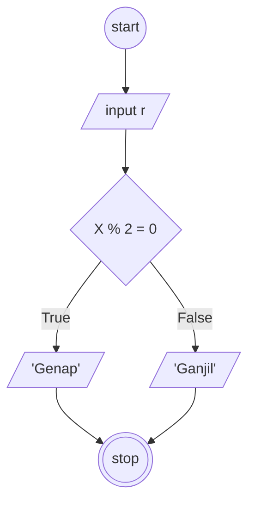

## Membuat algoritma ganjil dan genap

1. mulai
2. siapkan sebuah variabel "angka" yang berisi angka-angka dari 1-10
3. buat variable "genap" dan "ganjil" untuk menampung masing2 bilangan
4. untuk variable "genap" diisi oleh angka2 dari variable "angka" yang bisa dibagi 2
5. untuk variable "ganjil" diisi oleh angka2 dari variable "angka" yang tidak bisa dibagi 2
6. selesai

## Flowchart ganjil genap

#### Flowchart :

