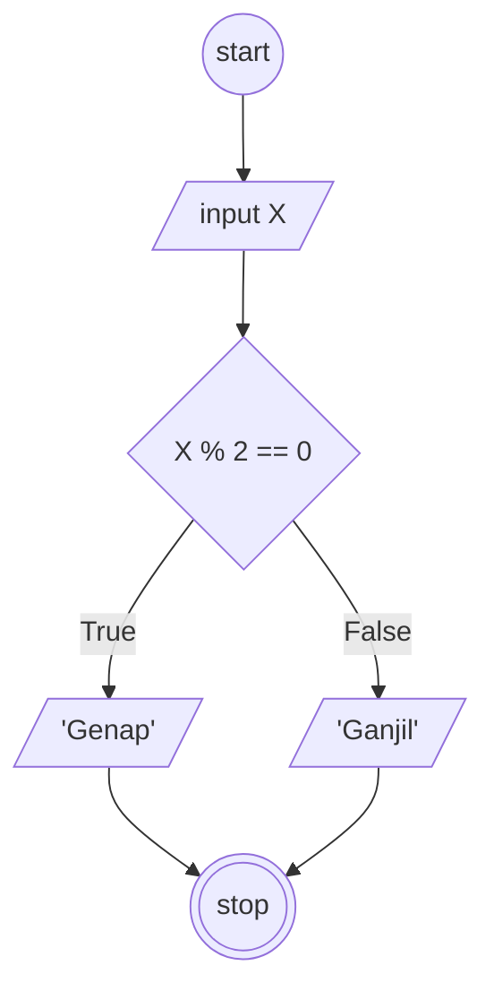

## Membuat algoritma ganjil dan genap

1. mulai
2. masukkan angka sebagai "X"
3. jika "X" tersebut habis dibagi dua, "X" adalah angka genap
4. jika tidak, "X" Adalah angka ganjil 
5. selesai

## Flowchart ganjil genap

#### Flowchart :


## Pseudo-code

```
DECLARE X: INTEGER
DECLARE Genap: REAL
DECLARE Ganjil: REAL

INPUT X

IF X % 2 == 0 THEN
    Ganjil <- X, "adalah angka Ganjil"
ELSE
    Genap <- X, "adalah angka Genap"
ENDIF

OUTPUT Ganjil
OUTPUT Genap
```
