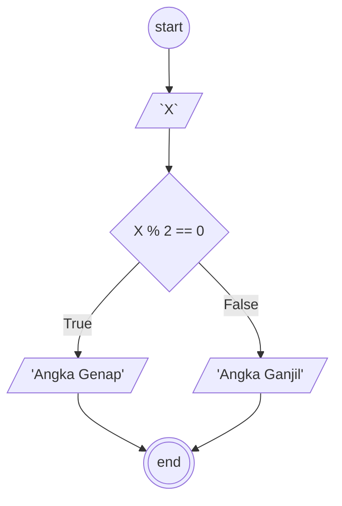

## Membuat algoritma ganjil dan genap

1. mulai
2. masukkan angka sebagai "X"
3. jika "X" tersebut habis dibagi dua, "X" adalah Angka Genap
4. jika tidak, "X" Adalah Angka Ganjil 
5. selesai

## Flowchart ganjil genap

#### Flowchart :


## Pseudo-code

```
DECLARE X: INTEGER
DECLARE Result: STRING

INPUT X

IF X % 2 == 0 THEN
    Result <- " adalah angka Genap"
ELSE
    Result <- " adalah angka Ganjil"
ENDIF

OUTPUT X, Result
```
