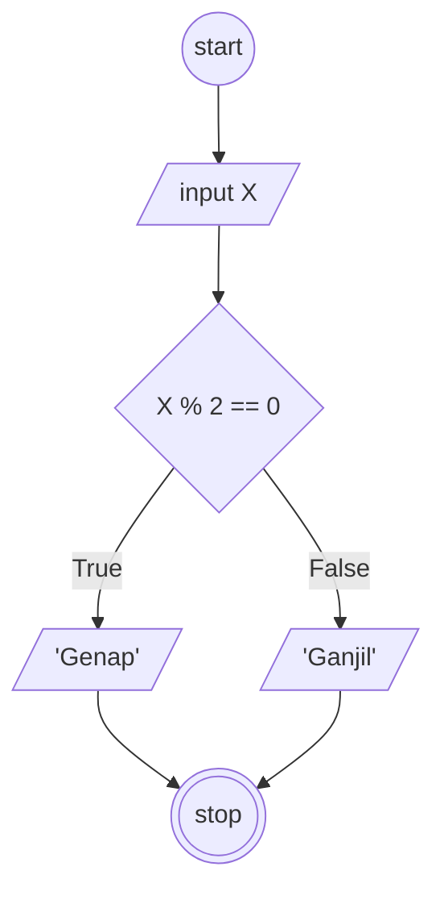

## Membuat algoritma ganjil dan genap

1. mulai
2. masukkan angka
3. jika angka tersebut habis dibagi dua, angka genap
4. jika tidak, angka ganjil 
5. selesai

## Flowchart ganjil genap

#### Flowchart :


## Pseudo-code

```
DECLARE Angka: INTEGER
DECLARE Genap: REAL
DECLARE Ganjil: REAL

INPUT Angka

IF Angka % 2 == 0 THEN
    Ganjil <- Angka, "adalah angka Ganjil"
ELSE
    Genap <- Angka, "adalah angka Genap"
ENDIF

OUTPUT Ganjil
OUTPUT Genap
```
