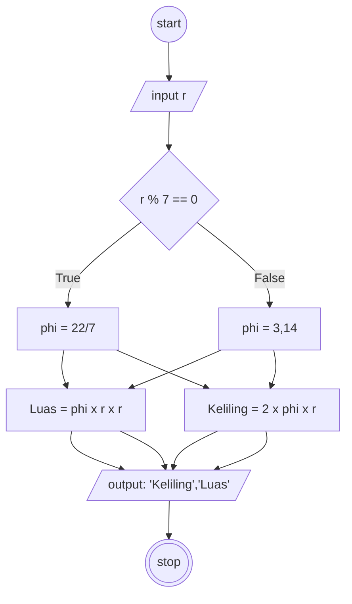

## Menghitung Luas dan Keliling Lingkaran

#### Deskriptif :

1. Mulai
2. Masukkan nilai r (jari-jari)
3. jika r habis dibagi 7 , maka phi = 22/7
4. jika tidak, maka phi = 3,14
5. hitung Luas dengan phi x r  x r
5. hitung Keliling dengan 2 x phi x r
6. selesai

#### Flowchart menghitung luas



## Pseudo-code

```
DECLARE r: REAL
DECLARE Keliling: REAL
DECLARE Luas: REAL

INPUT r

IF r % 7 == 0 THEN
    Luas <- 22/7 x r x r  
    Keliling <- 2 x 22/7 x r    
ELSE
    Luas <- 3,14 x r x r  
    Keliling <- 2 x 3,14 x r
ENDIF

OUTPUT "K : ", Keliling, "L : ", Luas

```
