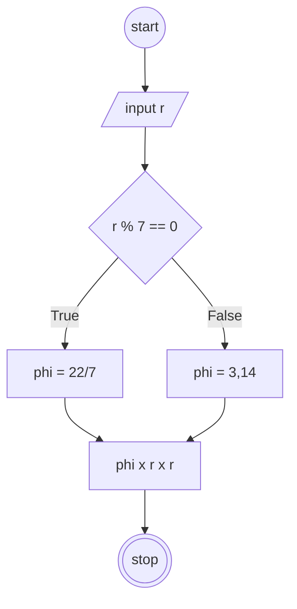
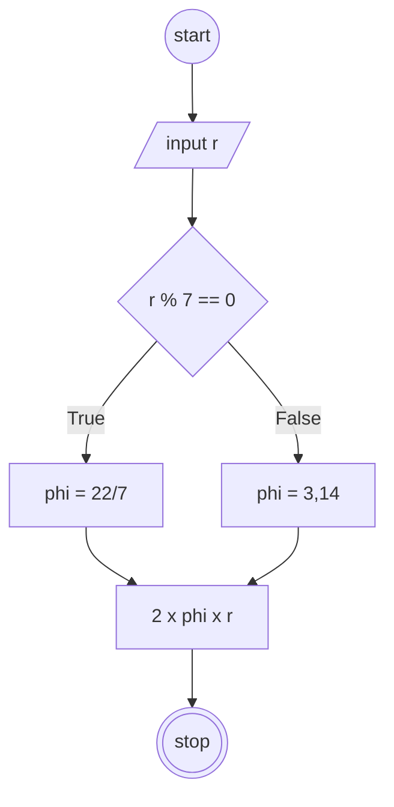

## Menghitung Luas dan Keliling Lingkaran

#### Deskriptif :

1. Mulai
2. Masukkan nilai r (jari-jari)
3. jika r habis dibagi 7 maka, phi = 22/7
4. jika tidak, maka phi = 3,14
5. hitung luas lingkaran dengan phi x r  x r
5. hitung keliling lingkaran dengan 2 x phi x r
6. selesai

#### Flowchart menghitung luas



#### Flowchart menghitung keliling



## Pseudo-code

#### Menghitung Luas
```
DECLARE r: REAL
DECLARE Result: REAL

INPUT r

IF r % 7 = 0 THEN
    Result <- 22/7 x r x r  
ELSE
    Result <- 3,14 x r x r  
ENDIF

OUTPUT Result

```

#### Menghitung Keliling
```
DECLARE r: REAL
DECLARE Result: REAL

INPUT r

IF r % 7 = 0 THEN
    Result <- 2 x 22/7 x r  
ELSE
    Result <- 2 x 2,14 x r  
ENDIF

OUTPUT Result

```
