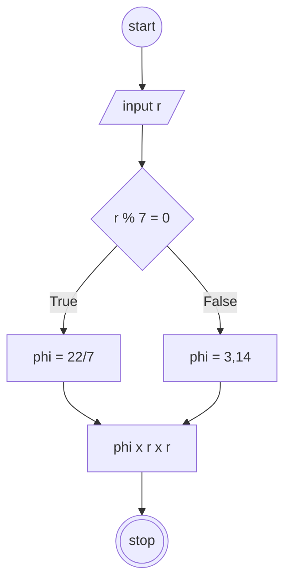
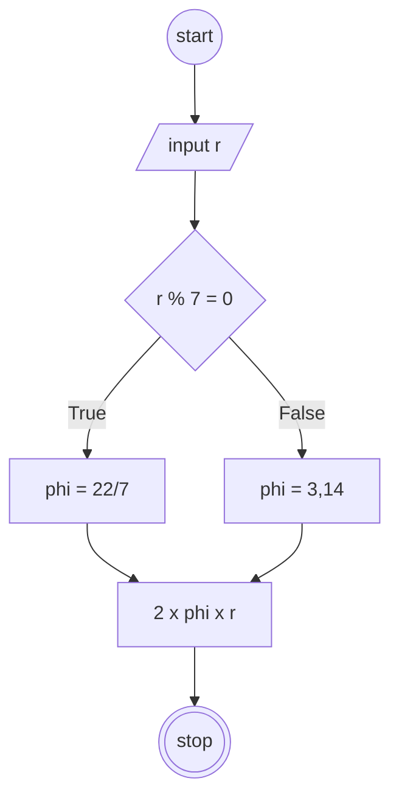

## Menghitung Luas dan Keliling Lingkaran

#### Deskriptif :

1. Mulai
2. Masukkan nilai r (jari-jari)
3. jika r habis dibagi 7 maka, phi = 22/7
4. jika tidak, maka phi = 3,14
5. hitung luas lingkaran dengan phi x r  x r
5. hitung keliling lingkaran dengan 2 x phi x r
6. selesai

#### Flowchart menghitung luas

#### Flowchart menghitung keliling

