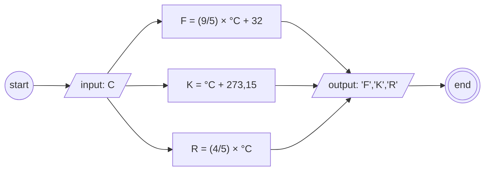

## Algoritma Konversi Suhu 

#### Deklaratif

1. mulai
1. masukkan suhu sebagai "C"
1. hitung F = (9/5) × C + 32
1. hitung K = C + 273,15
1. hitung R = (4/5) × C
1. tampilkan hasil perhitungan dari F, K dan R
1. selesai

#### Flowchart pemilihan type



## Pseudo-code

```
DECLARE Celcius: REAL
DECLARE Kelvin: REAL
DECLARE Reamur: REAL
DECLARE Fahrenheit: REAL

INPUT Celcius

Fahrenheit <- (9/5) × Celcius
Kelvin <- Celcius + 273,15
Reamur <- (4/5) × Celcius


OUTPUT "Hasilnya, f: ", Fahrenheit, " k : ", Kelvin, " r : ", Reamur
```
