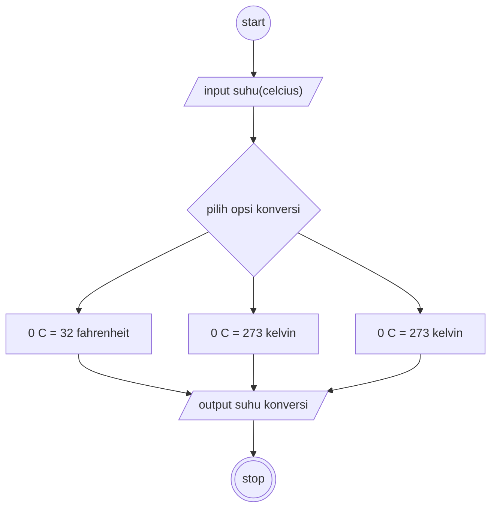

## mengubah algoritma celcius 

#### Deklaratif

1. mulai
2. deklarasikan bahwa 0 derajat celcius = 32 fahrenheit
3. deklarasikan bahwa 0 derajat celcius = 273 kelvin
4. masukkan nilai suhu dalam bentuk celcius
4. masukkan nilai suhu dalam bentuk celcius

#### Flowchart

