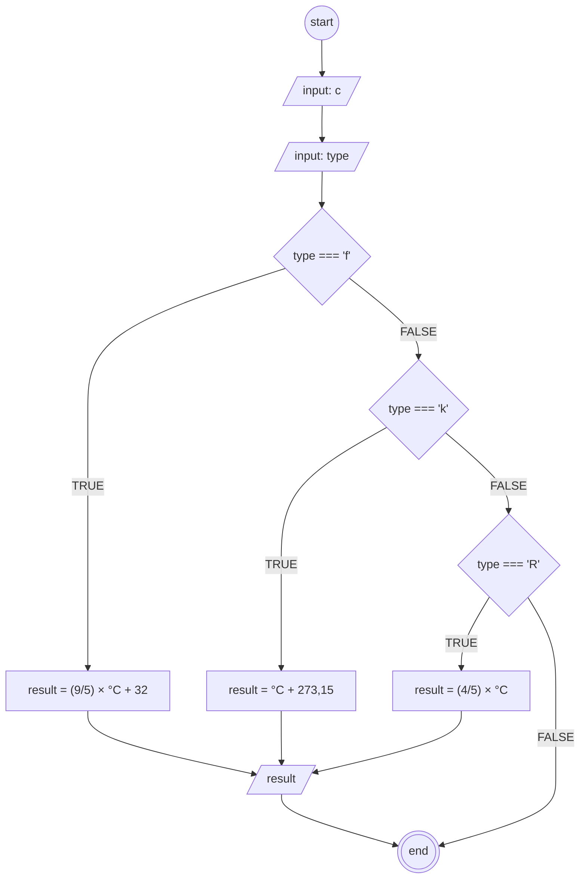

## Algoritma Konversi Suhu 

#### Deklaratif

1. mulai
1. masukkan suhu sebagai "c"
1. masukkan tipe konversi yang dipilih sebagai "type"
1. jika "type" = f, maka konversi menjadi "result = (9/5) × °C + 32"
1. jika "type" = k, maka konversi menjadi "result = °C + 273,15"
1. jika "type" = r, maka konversi menjadi "result = (4/5) × °C"
1. jika tidak, maka akhiri
1. selesai

#### Flowchart pemilihan type

### Notes